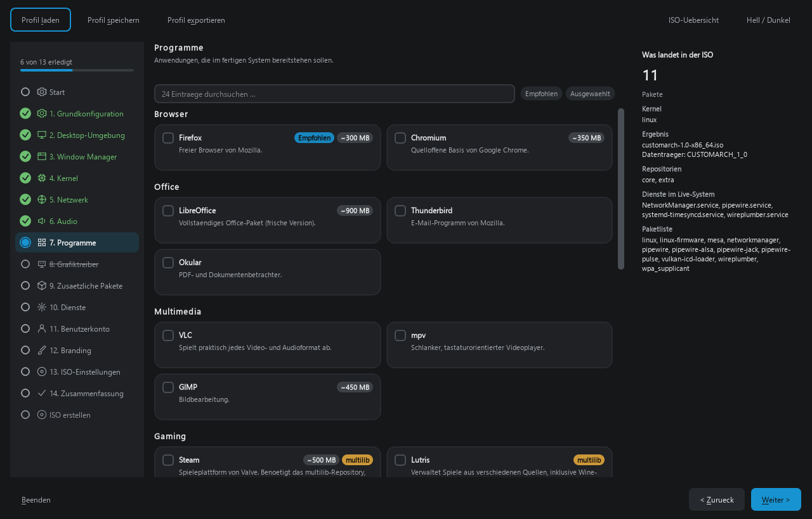

> **🇩🇪 Deutsch:** [README.md](README.md) — the full documentation is in German.
> **⚠️ The application interface is currently German only.** This page is here so
> you can judge whether the project is useful to you; using it comfortably still
> requires some German.

# ArchCustomiser / The Ultimate LARP Tool

If you’re too lazy or too stupid to set up Arch Linux yourself, this is a real goldmine for you.
This tool lets you create a bootable Arch ISO file that you can easily customize using a nice graphical interface; once you're done, you can finally tell everyone you use Arch Linux, even though you haven't got a clue what you're actually doing.
A better, more detailed guide is further down this page —
[Installation](#installation), [Command line](#command-line) and
[Architecture](#architecture-briefly). The full documentation is German:
[README.md](README.md).

A graphical builder for custom Arch Linux based live ISOs.

You click through a wizard — desktop environment, kernel, applications, network,
audio, locale, branding — and get a bootable ISO. No knowledge of `archiso`,
`pacman` or the internal ISO layout required.

This is **not** a reimplementation of Arch Linux. It is an automation layer on
top of the official infrastructure: `archiso`, `pacman`, the official
repositories, `systemd` and `archinstall`. Dependency resolution is done by
pacman, not by this program.



On the left the step list, including the steps that do not apply to your
selection at all. On the right, at all times, the answer to "what actually ends
up in my ISO". In the middle, the choice itself.

---

## The idea

`archiso` exists **only on Arch Linux** — Debian, Ubuntu, Fedora and openSUSE do
not package it at all. So instead of trying to make your system Arch-capable,
ArchCustomiser puts an Arch *next to* it and builds there:

| Your system | Build path | One-time setup |
|---|---|---|
| Arch Linux | directly | `sudo pacman -S --needed archiso` |
| Windows | WSL distribution | `wsl --install archlinux`, reboot, then `pacman -S archiso` |
| Ubuntu, Fedora, Debian, Mint | container | `sudo apt install podman` (Fedora ships it) |
| macOS | container | Docker Desktop |
| anything else | export the profile | nothing — build it on an Arch system |

**You never choose.** When you click "build ISO", the program checks what is
actually available, takes the best path and tells you which one in a single
sentence. If none is available it offers to export the archiso profile instead
of greying out a button.

One program, one download, one codebase — the three build paths are all in the
same binary and selected at runtime.

### About the container, stated plainly

It runs with `--privileged`. Not because of `mkarchiso` — that calls neither
`mount` nor `losetup` nor `mknod`. The reason is `pacstrap`: its `chroot_setup`
mounts eight filesystems into the target tree and needs `CAP_SYS_ADMIN`.

There is no rootless path: `devtmpfs` has no `FS_USERNS_MOUNT` flag in the
kernel and therefore cannot be mounted inside a user namespace at all. Arch
builds its own release ISOs the same way.

### A build never gets the whole machine

This is a guarantee, not a setting. A build takes **half the cores**; the rest
stays free so you can keep using the computer. The number is shown before the
build starts.

The reason is a real incident on 2026-09-03: a build on a twelve-core machine
froze Windows completely — no window could be moved, the cancel button was out
of reach, only a hard reboot helped. The last line in the log read
`Parallel mksquashfs: Using 12 processors`.

Given no limit, `mksquashfs` starts one compression thread per visible core —
and under WSL2 without a `.wslconfig` that means every core of the host. So the
program pins the build itself (`taskset`, or `--cpus` for the container), on all
three build paths. You do **not** need to write a `.wslconfig`.

Cancelling now runs beside the interface rather than inside it, so the window
stays responsive while the build is being stopped.

---

## Installation

### Windows

1. **Code → Download ZIP** on the project page, or:

   ```bash
   git clone https://github.com/Peter362187/Easy-Arch-Linux.git
   ```

2. Double-click **`ArchCustomiser.bat`**.

That is all. On first run it sets up the Python environment itself (a few
minutes, around 670 MB). After that a double-click starts the program straight
away. If Python is missing it says so and opens the download page — tick **"Add
Python to PATH"**. Python 3.11 or newer is required.

### Linux and macOS

```bash
git clone https://github.com/Peter362187/Easy-Arch-Linux.git && cd Easy-Arch-Linux
```

```bash
./archcustomiser.sh
```

If the shell says `Permission denied`, the executable bit was lost on
download — use `chmod +x archcustomiser.sh`, or just `sh archcustomiser.sh`,
which always works.

The counterpart to `ArchCustomiser.bat`: it sets up the environment on first
run and just starts the program afterwards. Every failure path names the
command that fixes it, matched to the package manager it finds (apt, dnf,
zypper, pacman, brew).

By hand, if you prefer:

```bash
python -m venv .venv && .venv/bin/pip install -e ".[dev]"
```

```bash
.venv/bin/python -m archcustomiser
```

Or, without a source directory:

```bash
pipx install git+https://github.com/Peter362187/Easy-Arch-Linux.git
```

**On a minimal Linux install** PySide6 ships Qt but not its system libraries, so
the program fails to start with `Could not load the Qt platform plugin "xcb"`.
Once:

```bash
sudo apt install libgl1 libegl1 libxkbcommon-x11-0 libxcb-cursor0 libxcb-icccm4 libxcb-keysyms1 libxcb-shape0 libdbus-1-3 fontconfig
```

```bash
sudo dnf install mesa-libGL libxkbcommon-x11 xcb-util-cursor xcb-util-wm xcb-util-keysyms
```

Arch gets this via `qt6-base` anyway; Windows and macOS need nothing.

---

## Command line

```bash
python -m archcustomiser --check-env
```

```bash
python -m archcustomiser --dry-run src/archcustomiser/profiles/gaming.yaml
```

```bash
python -m archcustomiser --export-profile src/archcustomiser/profiles/gaming.yaml --out ~/flos-profile.tar.gz
```

And with no display at all — for a server, an SSH session, or a script that
builds overnight:

```bash
python -m archcustomiser --build ~/my-profile.yaml --out-dir ~/isos
```

Progress goes to stderr, the summary to stdout, so `--build … > result.txt`
holds the summary and not three thousand mkarchiso lines. `Ctrl+C` cancels the
build instead of killing it. A password is read from standard input and never
from an argument — on Linux an argument is readable by anyone via `/proc`:

```bash
pass show arch/live | python -m archcustomiser --build profile.yaml --password-stdin
```

Exit codes: `0` done, `1` failed, `2` bad input, `3` cancelled, `4` preflight
blocked.

```bash
python -m archcustomiser --verify-iso ~/isos/flos-1.0-x86_64.iso
python -m archcustomiser --history
```

The first checks an existing ISO for plausibility — CD001 signature, MBR
signature, El Torito boot catalogue, sector alignment. The second lists what
has been built on this machine.

---

## Architecture, briefly

```
src/archcustomiser/
├── core/                    no Qt at all — testable without a display
│   ├── catalog/             YAML model, loader, predicates
│   ├── packages/            package validation against the real Arch repos
│   ├── archiso/             profile generation: tree, sinks, bootloader
│   ├── build/               three build paths (local, WSL, container)
│   └── …
├── gui/                     PySide6
│   ├── navigation.py        step model — no Qt, testable without a display
│   ├── design/              colours, spacing, type, theme switching
│   └── previews/            previews, wired up through the catalog
├── data/catalog/            the entire option set, as YAML
└── profiles/                bundled profiles
```

Two properties are enforced by tests rather than by convention:

* **`core/` never imports Qt.** Checked in a separate process.
* **The build controller does not know which target it is talking to.** All
  twelve differences live behind the `ExecutionTarget` protocol; a test asserts
  that no `isinstance` check on the target type comes back.

**The catalog is the program.** The interface does not know a single desktop
environment by name. There are four page types (`selection`, `form`,
`free_packages`, `summary`); everything else is YAML. A new desktop, kernel,
input field or whole category is a catalog entry — not a line of Python.

---

## What is verified and what is not

This distinction belongs in the documentation, not in the small print:

| | State |
|---|---|
| Interface on Windows | in daily use |
| ISO build via WSL | **two real ISOs built**, 1311 MB and 2525 MB |
| CPU limit during a build | **measured on real hardware**: mksquashfs reports 6 threads instead of 12 |
| Profile generation and export | covered by tests and in use |
| ISO build directly on Arch | covered by tests, not run on real hardware |
| **ISO build in a container** | **calls covered by tests, never run on a real Ubuntu, Fedora or Mac** |
| Boot test of the finished ISO | outstanding |

The container path is carefully built and follows what Arch does for its own
ISOs — but "should work" is not the same as "works". Reports from real systems
are welcome.

---

## Trademark note

The generated system identifies itself honestly. `/etc/os-release` always
carries `ID_LIKE=arch` and a `PRETTY_NAME` containing "based on Arch Linux";
names that would pass the system off as Arch Linux itself are rejected by the
validator, following the Arch Linux trademark policy.

---

## Further reading

The complete documentation is German:

* **[README.md](README.md)** — full user documentation
* **[docs/DEVELOPMENT.md](docs/DEVELOPMENT.md)** — architecture, design decisions
  and the reasoning behind them

Over 700 tests, no network and no display required:

```bash
python -m pytest -q
```

The same run happens on [GitHub Actions](.github/workflows/ci.yml) for every
push: Ubuntu, Windows and macOS x Python 3.11 to 3.13, plus `ruff`, `mypy` and
a job that imports `core/` **without PySide6 installed** — with Qt present, an
accidental import could slip through unnoticed.
